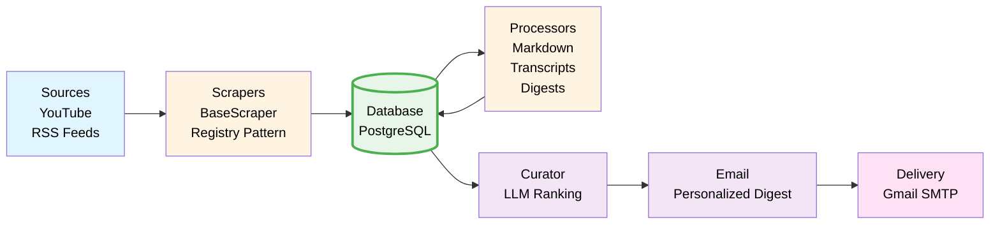

# AI News Aggregator

An intelligent news aggregation system that scrapes AI-related content from multiple sources (YouTube channels, RSS feeds), processes them with LLM-powered summarization, curates personalized digests based on user preferences, and delivers daily email summaries.

## Overview

This project aggregates AI news from multiple sources:
- **YouTube Channels**: Scrapes videos and transcripts from configured channels
- **RSS Feeds**: Monitors OpenAI and Anthropic blog posts
- **Processing**: Converts content to markdown, generates summaries, and creates digests
- **Curation**: Ranks articles by relevance to user profile using LLM
- **Delivery**: Sends personalized daily email digests

## Architecture



## How It Works

### Pipeline Flow

1. **Scraping** (`app/runner.py`)
   - Runs all registered scrapers
   - Fetches articles/videos from configured sources
   - Saves raw content to database

2. **Processing** (`app/services/process_*.py`)
   - **Anthropic**: Converts HTML articles to markdown
   - **YouTube**: Fetches video transcripts
   - **Digests**: Generates summaries using LLM

3. **Curation** (`app/services/process_curator.py`)
   - Ranks digests by relevance to user profile
   - Uses LLM to score and rank articles

4. **Email Generation** (`app/services/process_email.py`)
   - Creates personalized email digest
   - Selects top N articles
   - Generates introduction and formats content
   - Marks digests as sent to prevent duplicates

5. **Delivery** (`app/services/email.py`)
   - Sends HTML email via Gmail SMTP

### Daily Pipeline

The `run_daily_pipeline()` function orchestrates all steps:
- Ensures database tables exist
- Scrapes all sources
- Processes content (markdown, transcripts)
- Creates digests
- Sends email

## Project Structure

```
ai-news-aggregator/
├── app/                           # Main application package
│   ├── agent/                     # LLM agents for processing
│   │   ├── base.py               # Base agent class
│   │   ├── curator_agent.py       # Article ranking & curation
│   │   ├── digest_agent.py        # Summary generation
│   │   ├── email_agent.py         # Email content generation
│   │   ├── hf_adapter.py          # Hugging Face Inference API adapter
│   │   └── __init__.py
│   ├── database/                  # Database layer
│   │   ├── models.py              # SQLAlchemy models (YouTubeVideo, Article)
│   │   ├── repository.py          # Data access layer
│   │   ├── connection.py          # DB connection & environment config
│   │   ├── create_tables.py       # Database initialization
│   │   ├── check_connection.py    # Connection verification
│   │   ├── README.md
│   │   └── __init__.py
│   ├── profiles/                  # User profile configuration
│   │   ├── user_profile.py        # User interests & preferences
│   │   └── __init__.py
│   ├── scrapers/                  # Content scrapers
│   │   ├── base.py                # Base scraper for RSS feeds
│   │   ├── anthropic.py           # Anthropic RSS scraper
│   │   ├── openai.py              # OpenAI RSS scraper
│   │   ├── youtube.py             # YouTube channel scraper
│   │   └── __init__.py
│   ├── services/                  # Processing services
│   │   ├── base.py                # Base process service
│   │   ├── process_anthropic.py   # Markdown conversion for Anthropic articles
│   │   ├── process_youtube.py     # Transcript fetching for YouTube videos
│   │   ├── process_digest.py      # Digest creation from articles
│   │   ├── process_curator.py     # Ranking & curation of digests
│   │   ├── process_email.py       # Email digest generation & sending
│   │   ├── email.py               # SMTP email sending (Gmail)
│   │   └── __init__.py
│   ├── config.py                  # Configuration (YouTube channels, settings)
│   ├── runner.py                  # Scraper registry & execution
│   ├── daily_runner.py            # Main pipeline orchestrator
│   ├── __init__.py
│   └── example.env                # Example environment variables
├── scripts/                       # Utility scripts
│   ├── db_inspect.py              # Inspect database contents
│   ├── check_unsent.py            # Check unsent digests
│   ├── unmark_recent_digests.py   # Reset sent flags for re-sending
│   ├── test_smtp.py               # SMTP connection test
│   └── test_hf_digest.py          # Test Hugging Face adapter
├── docker/                        # Docker configuration
│   └── docker-compose.yml         # PostgreSQL service definition
├── docs/                          # Documentation
│   ├── DEPLOYMENT.md
│   └── RENDER_SETUP.md
├── main.py                        # Entry point (runs daily pipeline)
├── pyproject.toml                 # Project metadata & dependencies
├── requirements.txt               # pip dependencies (mirrors pyproject.toml)
├── Dockerfile                     # Container image definition
└── render.yaml                    # Render deployment config
```

## Adding New Scrapers

### RSS Feed Scraper (Easiest)

Create a new file in `app/scrapers/`:

```python
from typing import List
from .base import BaseScraper, Article

class MyArticle(Article):
    pass

class MyScraper(BaseScraper):
    @property
    def rss_urls(self) -> List[str]:
        return ["https://example.com/feed.xml"]

    def get_articles(self, hours: int = 24) -> List[MyArticle]:
        return [MyArticle(**a.model_dump()) for a in super().get_articles(hours)]
```

Then register it in `app/runner.py`:

```python
from .scrapers.my_scraper import MyScraper

def _save_my_articles(scraper, repo, hours):
    return _save_rss_articles(scraper, repo, hours, repo.bulk_create_my_articles)

SCRAPER_REGISTRY = [
    # ... existing scrapers
    ("my_source", MyScraper(), _save_my_articles),
]
```

### Custom Scraper

For non-RSS sources, inherit from the base pattern:

```python
class CustomScraper:
    def get_articles(self, hours: int = 24) -> List[Article]:
        # Your custom scraping logic
        pass
```

## Setup

### 1. Prerequisites
- **Python 3.12+** (recommended: install from python.org)
- **Docker Desktop** (for running PostgreSQL)
- **Git** (to clone the repository)
- **Gmail app password** (for email sending)
- **Webshare proxy credentials** (optional, for YouTube transcript fetching)

### 2. Clone the Repository
```powershell
git clone <repo-url>
cd ai-news-aggregator
```

### 3. Create and Activate Virtual Environment
```powershell
python -m venv .venv
.venv\Scripts\activate
```

### 4. Install Dependencies
```powershell
pip install -r requirements.txt
```

### 5. Set Up Environment Variables
- Copy `.env.example` to `.env` and fill in your values:
  - `DATABASE_URL` (default: postgresql://postgres:<password>@127.0.0.1:5433/ai_news_aggregator)
  - `MY_EMAIL` (your Gmail address)
  - `APP_PASSWORD` (Gmail app password)
  - `OPENAI_API_KEY` or `HF_API_TOKEN` (for LLM, optional)

   # Optional: Webshare Proxy (for YouTube transcript fetching)
   # Get credentials from https://www.webshare.io/
   WEBSHARE_USERNAME=your_username
   WEBSHARE_PASSWORD=your_password

- Example:
```powershell
copy .env.example .env
# Edit .env in your editor
```

### 6. Start PostgreSQL Database (Docker)
```powershell
docker compose -f docker\docker-compose.yml up -d
```
- This will start a Postgres 17 container on port 5433 with persistent storage.

### 7. Initialize Database Tables
- The pipeline will auto-create tables on first run, but you can run:
```powershell
.venv\Scripts\python.exe app\database\create_tables.py
```

### 8. Configure YouTube channels in `app/config.py`

### 9. Update user profile in `app/profiles/user_profile.py`

### 10. Run the Pipeline
```powershell
.venv\Scripts\python.exe main.py 24 10
```
- This scrapes sources, processes articles, creates digests, and sends the daily email.

### 11. Troubleshooting
- If you see DB connection errors, ensure Docker is running and the container is healthy.
- For email errors, check your Gmail app password and `MY_EMAIL` in `.env`.
- For LLM errors, check your API key/token and model access.

### 12. Optional: Inspect Database
```powershell
.venv\Scripts\python.exe scripts\db_inspect.py
```
- Shows sample articles and digests in the database.

---

For more details, see the comments in each script and the architecture section above.


### Using Hugging Face as the LLM provider

- Sign up / login to Hugging Face and create an access token: https://huggingface.co/settings/tokens
- In your `.env` set:
   - `LLM_PROVIDER=hf`
   - `HF_API_TOKEN=<your_token>`
   - Optional: `HF_MODEL=<model-identifier>` (example: `google/flan-t5-large`, or a Llama/Falcon chat model)

- Example `.env` entries:

```
LLM_PROVIDER=hf
HF_API_TOKEN=hf_xxxYourTokenHere
HF_MODEL=google/flan-t5-large
```

Notes:
- The Hugging Face Inference API free tier allows testing but may have usage limits; choose a model appropriate for your quota and latency needs.
- Some models return plain text; for better structure you can prompt them to return JSON and update `app/agent/hf_adapter.py` to parse JSON.
   ```
   
   **Note**: Webshare proxy is optional. If not provided, YouTube transcript fetching will work without a proxy but may be rate-limited.


## Deployment

### Render.com

The project is configured for deployment on Render.com:

1. **Database**: PostgreSQL service (auto-configured)
2. **Cron Job**: Scheduled daily execution via `render.yaml`
3. **Environment**: Automatically detected as PRODUCTION when `DATABASE_URL` contains "render.com" (no manual setting needed)

See `RENDER_SETUP.md` for detailed deployment instructions.

### Docker

Build and run:
```bash
docker build -t ai-news-aggregator .
docker run --env-file .env ai-news-aggregator
```

## Key Features

- **Modular Architecture**: Base classes make it easy to extend
- **Scraper Registry**: Add new sources with minimal code
- **LLM-Powered**: Uses OpenAI for summarization and curation
- **Personalized**: User profile-based ranking
- **Duplicate Prevention**: Tracks sent digests
- **Environment Aware**: Supports LOCAL and PRODUCTION environments

## Technology Stack

- **Python 3.12+**: Core language
- **PostgreSQL**: Database
- **SQLAlchemy**: ORM
- **Pydantic**: Data validation
- **OpenAI API**: LLM processing
- **feedparser**: RSS parsing
- **youtube-transcript-api**: Video transcripts
- **UV**: Package management
